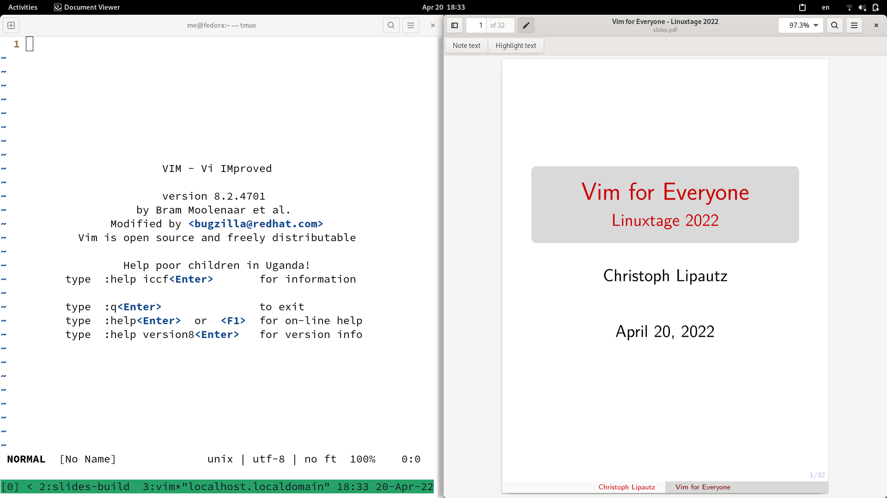
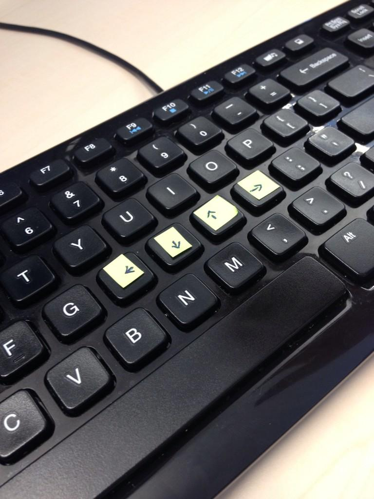
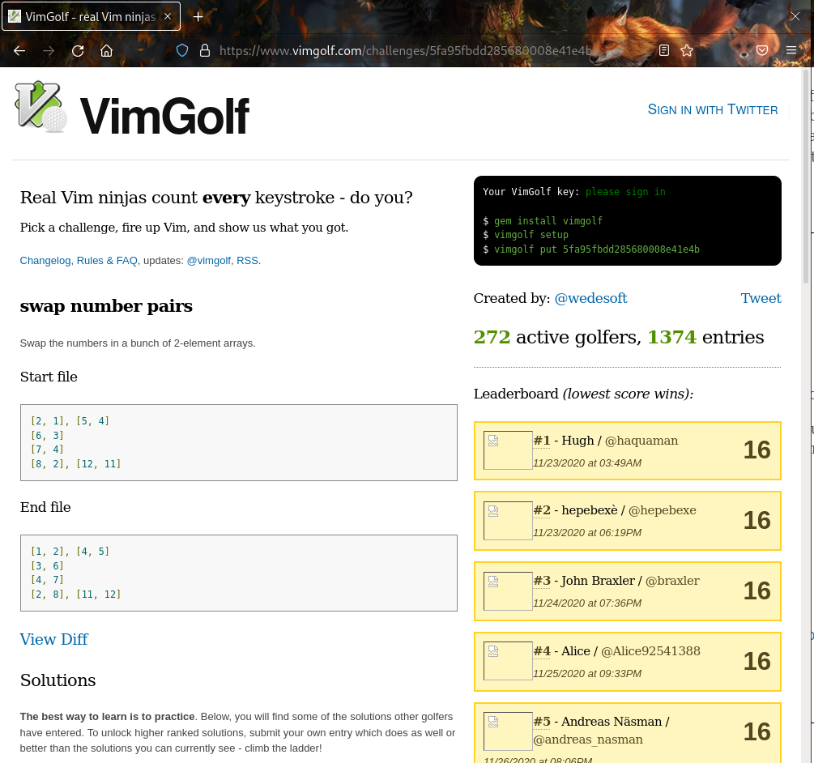
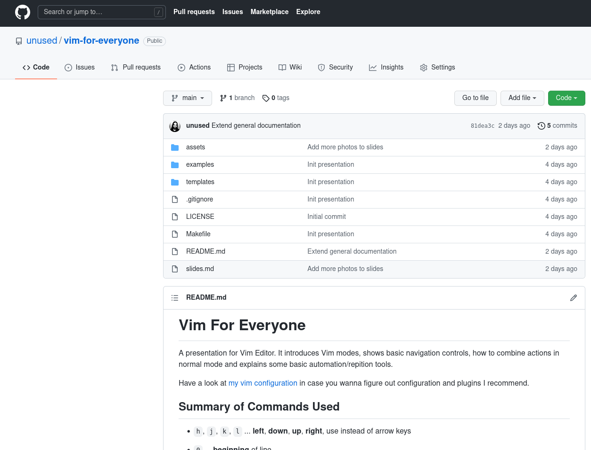

# Presentation Setup

# Overview

Vim is a powerful text editor, we will learn to use it to:

- Edit Text Efficiently

- Automate Simple Text Manipulation

# My History with Vim

Long story short:

|   I switched from Kate to Vim
|   because I lost a bet.

# Context Switch

* * * *

* * * *

* * * *

# First Step to Understand Vim

Vim works in modes!

- INSERT Mode ... write text

- NORMAL Mode ... manage text,
navigate around

- COMMAND Mode ... run a command
(e.g. save file, exit, search & replace, etc.)

- Others (VISUAL Mode, etc)

* * * *

NORMAL, press `i`

INSERT, type stuff, exit `<ESC>`

NORMAL, press `:`

COMMAND, type `write<ENTER>`

NORMAL, press `v`

VISUAL, exit `<ESC>`

# Quit Vim

If you don't know anything about **modes**,
Vim is just a random password generator.

* * * *

`:help quit`

...

`:q[uit]!` $\Rightarrow$ quit and don't warn about unsaved changes

# Mnemonics: Think of...

NORMAL mode actions are just keystrokes.

\spacer

We want to `i`nsert some text.

We want to `v`isualize some text.

# Navigation

`w` ... move one `w`ord

\spacer

**NORMAL**

# More Navigation

`w` ... move one `w`ord

`e` ... move to the `e`nd of a word

`b` ... move `b`ack a word

`f` ... `f`ind character (in current line)

\spacer

**NORMAL**

# Navigation At Your Fingertips

Not every action has mnemonics

- `x` ... **cross out**, delete character under cursor

- `0`, `^`, `$` ... **beginning**, **start** (of text) and **end** of line

- Use `h`, `j`, `k`, `l` instead of arrow keys (optional but strongly
  recommended)

\spacer

**NORMAL**

* * * *

# Delete

`dw`

\spacer

**NORMAL**

Delete a word.

* * * *

`de`

`db`

\spacer

**NORMAL**

Delete some words.

* * * *

`0dfa`

\spacer

Jump to the beginning of a line and delete until the first **a** character.

Golf Score: 4

# Vim Golf

{width=100%}

# Delete a Word

We can combine commands:

- `dw` ... `d`elete a `w`ord

- `de`, `db`

- `df<char>`

- `d$` or shorthand `D`

- `dd` shorthand to delete a line

::: notes
  Hint: Use a uncommon char (e.g. x, y) it.
  Hint: Deleting & rewriting a line is likely to be faster than editing.
:::

# Change a Word

`cw` ... delete a word and switch to insert mode

`ce`, `cb`, `cf<char>`, `c$` or `C`, `cc`

# Visualize a ...

`fwveeedx`

\spacer

Visualize a word word word word then delete them.

# The . Command

The `.` command is a superfast way to repeat the last action.

* * * *

`wwcethree<ESC>jjb.`

\spacer

1 2 3 4 5

one two two four five

one two two four five

# Manual Search & Replace

- `/` ... search

- `cw` ... `c`hange `w`ord

- `n` ... `n`ext found text

- `.` ... repeat action (e.g. `cw`, `d3w`, ...)

# ; Repeat Find

`f<char>;` ... repeat the `f`ind

\spacer

`fa;x`

Move around conveniently with find aand repeat.

# The Macro Command

Start recording: \
`q<char>`, e.g. `qq` \
for using register `q`.

\spacer

Repeat recorded automation: \
`@<char>`, e.g. `@q`.

# Vim Automation

Can be helpful if we have a one-time job at hand and search & replace won't do
the job.

\spacer

For automation of regular/recurring jobs please stick to scripting.

# Hint: Visual Cues

`cip` changes the current paragraph (under cursor), that can lead to an
unexpected result.

Instead use `vip`, then decide if the expected selection is given and press `c`
to change it.

# Hint: Never Stop Learning

- Master switching to insert using `i`, `a`, `I`, `A`, `o`, `O`.

- Figure out the possibilities with command mode actions.

- Checkout Plugins (fuzzy finding file opening, file browsers, code formatter
  testsuite runner, etc).

# Examples

- Swap un/ordered Lists (Markdown)

- Manipulate CSV Files

- Edit your Shell Commands

# Resources

- Run `$ vimtutor`

- Find some Vim Community

- Your very welcome to research, use or discuss my Vim configuration at \
  [github.com/unused/.vim](https://github.com/unused/.vim)

# GitHub

